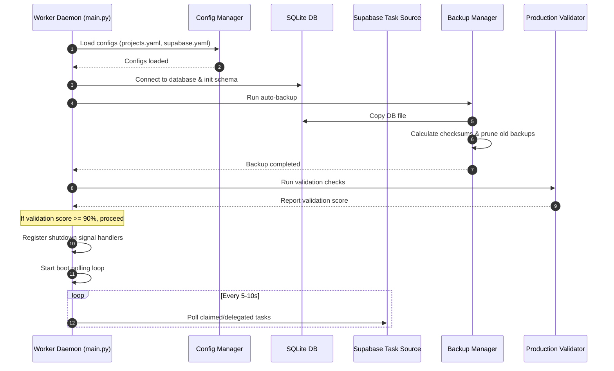
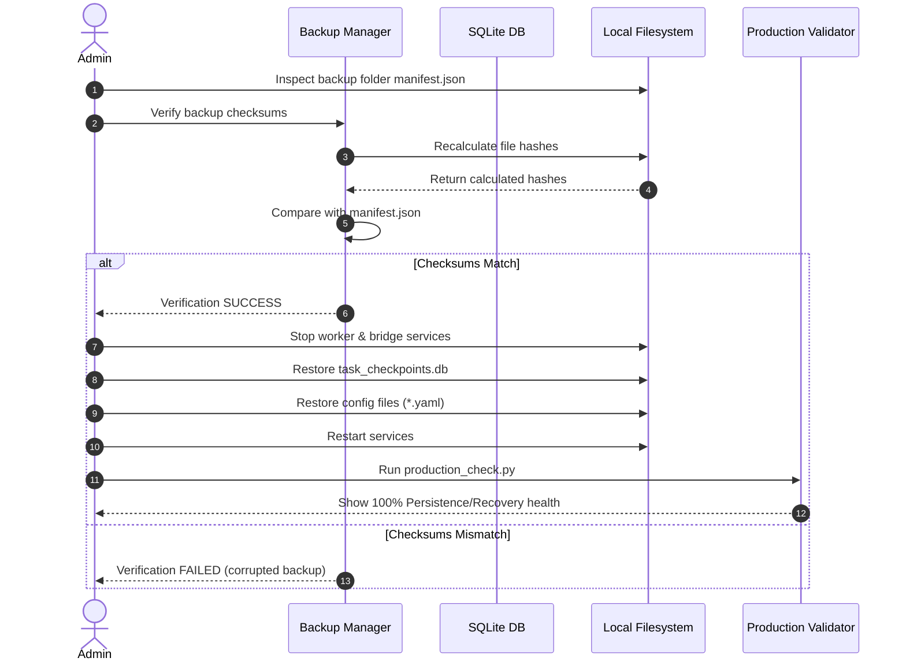

# Sequence Diagrams

This document contains Mermaid diagrams describing the sequence flows of key system operations.

## Task Execution Sequence

```mermaid
sequenceDiagram
    autonumber
    actor Operator
    participant WD as Worker Daemon (main.py)
    participant DP as Dispatcher
    participant WM as Workspace Manager
    participant AW as Antigravity Worker
    participant AC as Antigravity Client
    participant DB as SQLite DB
    participant TS as Supabase Task Source

    WD->>TS: Claim Task (INBOX)
    TS-->>WD: Return claimed task info
    WD->>DP: execute_task(task)
    DP->>WM: prepare_workspace(project)
    WM-->>DP: Return workspace_info
    DP->>AW: dispatch_task(task, workspace_info)
    
    rect rgb(30, 30, 40)
        note right of AW: Check Active Session
        AW->>DB: Query persistent session
        DB-->>AW: Return session metadata (conv_id)
        AW->>AC: Check session status (conv_id)
        AC-->>AW: Active/Expired
    end

    alt Session Active
        AW->>AC: send_message(conv_id, prompt)
    else Session Expired/None
        AW->>AC: new_conversation(full_prompt)
        AC-->>AW: Return new conv_id
        AW->>DB: Save session metadata
    end

    AW->>DB: Save delegation state (checkpoint)
    AW->>TS: Update status to delegated
    AW-->>DP: Return DELEGATED result
    DP-->>WD: Return execution status
```

## Worker Restart Sequence

## Recovery Flow Sequence

